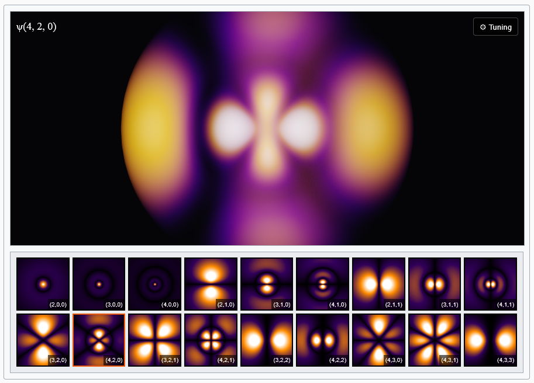

# orbital-viewer-js



A standalone, mathematically exact volumetric raymarcher for hydrogen atomic orbitals built on top of Three.js.

👉 **[View the Live Interactive Demo](https://robbobbins.github.io/orbital-viewer-js/examples/index.html)**

*(Note: To view the live demo link above, simply enable GitHub Pages for the `main` branch in your repository settings.)*

<br>

**LISTEN TO: [PGNIP.ca](https://pgnip.ca) &mdash; a hilarious Canadian comedy podcast.**

<br>

Most orbital visualizations on the web rely on scatter plots or particle systems that loosely approximate probability density. This library uses a custom GLSL raymarching shader to analytically evaluate the real spherical harmonics and generalized Laguerre polynomials directly on the GPU. It accumulates the |&psi;|&sup2; probability density through the volume and applies ACES Filmic Tone Mapping to gracefully handle highlights.

The result is a perfectly smooth, physically accurate, 60-fps glowing volumetric cloud of an atom.

An interactive example implementation—complete with a dynamic 2D thumbnail gallery—is included in the [`examples/index.html`](examples/index.html) file of this repository.

## Installation

```bash
npm install orbital-viewer-js three
```
*Note: `three` is required as a peer dependency.*

## Quick Start

```javascript
import * as THREE from 'three';
import OrbitalViewer from 'orbital-viewer-js';

// Get a container element with a defined width and height
const container = document.getElementById('my-viewer');

// Initialize the viewer
const viewer = new OrbitalViewer(container, {
  n: 3,                 // Principal quantum number
  l: 2,                 // Azimuthal quantum number
  m: 0,                 // Magnetic quantum number
  autoRotateSpeed: 1.5  // Optional: Rotation speed (0 to disable)
});

// Change the orbital dynamically
viewer.setQuantumNumbers(4, 2, 0);

// Adjust rendering properties dynamically
viewer.setTuning({
  brightness: 0.10,
  shadowBoost: 0.45,
  coreExposure: 0.60,
  colorCurve: 0.70
});
```

## Constructor Options

| Option | Type | Default | Description |
|---|---|---|---|
| `n` | `number` | `4` | Principal quantum number. Controls energy/size. |
| `l` | `number` | `2` | Azimuthal quantum number ($l < n$). Controls shape. |
| `m` | `number` | `0` | Magnetic quantum number ($-l \le m \le l$). Controls orientation. |
| `brightness` | `number` | `0.10` | Global multiplier before tone mapping. |
| `shadowBoost` | `number` | `0.45` | Fractional power curve applied to raw densities to recover faint outer shells. |
| `coreExposure` | `number` | `0.60` | Normalizes clipping on high-amplitude directional orbitals vs diffuse $s$-orbitals. |
| `colorCurve` | `number` | `0.70` | Power curve controlling the transition from purple to bright orange. |
| `autoRotateSpeed`| `number` | `1.5` | Speed of the orbital's automatic rotation. |

## Methods

*   **`setQuantumNumbers(n, l, m)`**: Loads a new orbital mathematically without recreating geometry. The engine will automatically sample the new orbital to normalize its true amplitude.
*   **`setTuning(options)`**: Update rendering parameters (`brightness`, `shadowBoost`, `coreExposure`, `colorCurve`).
*   **`dispose()`**: Cleans up the Three.js renderer and DOM nodes to prevent memory leaks in single-page applications.
*   **`OrbitalViewer.generateThumbnail(n, l, m)`**: Static helper method that returns a dynamically drawn 2D `<canvas>` element representing the orbital slice (used to generate thumbnail galleries).

## License

MIT

